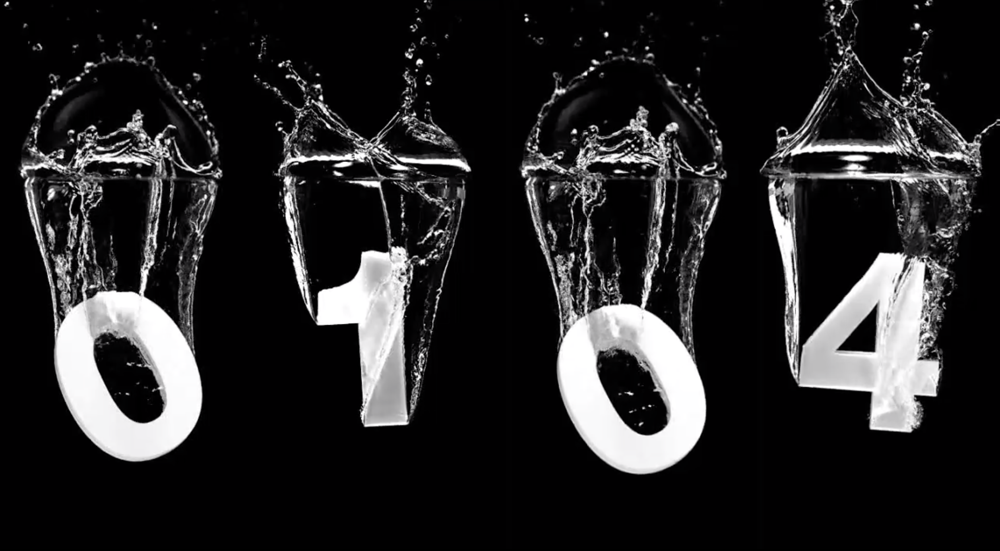

# DROPCLOCK

A Web Version of the famous Dropclock Screensaver (originated from http://scr.sc)

### Information

This is an adaption of the Dropclock Screensaver for running in web browsers.

### Platform

This version is build to run on a Raspberry Pi 3+, therefore mp4 instead of swf files were necessary due to performance issues.
 The original version (using flash) might be available later.

### Progress

ToDo:

- [ ] Handle start situation (black screen on chrome)
- [ ] Optimize asset loading
- [ ] Upload assets

Done:

- [x] Add random start delay
- [x] Implement basic swf playback
- [x] Setup base layout
- [x] Add option for color inversion (white mode)
- [x] Convert SWF to mp4 due to performance
- [x] Add fadings on number change